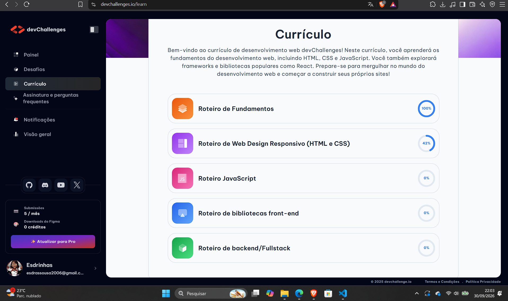
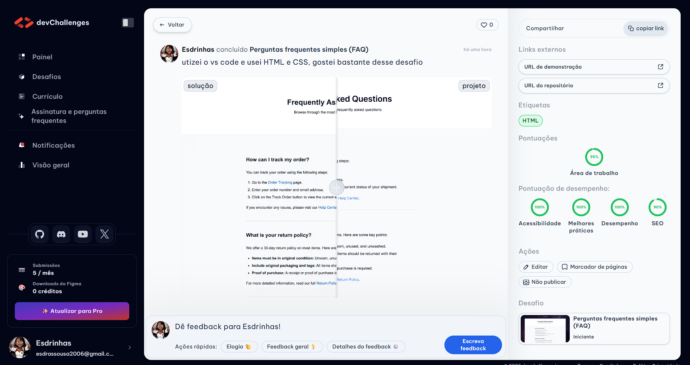
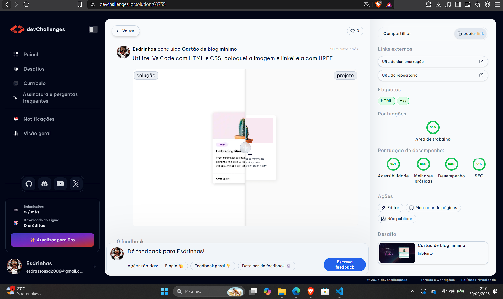
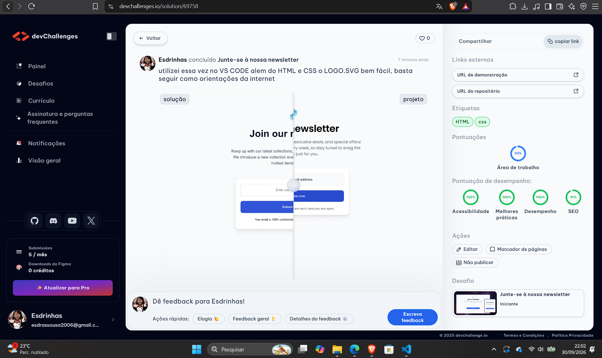

# 💻 Desafios de Desenvolvimento Web

## 📚 Atividade de Design

Este repositório foi criado para apresentar os desafios realizados na plataforma **DevChallenges**, como parte das atividades da disciplina de Design.

Durante as atividades foram utilizados conhecimentos de **HTML e CSS**, colocando em prática os conteúdos estudados em aula.

---

# 📊 Meu progresso no DevChallenges

Abaixo está o registro do meu progresso atual no currículo da plataforma DevChallenges:

### 📈 Progresso atual

- 🟠 **Roteiro de Fundamentos:** 100%
- 🟣 **Roteiro de Web Design Responsivo (HTML e CSS):** 42%
- 🩷 **Roteiro JavaScript:** 0%
- 🔵 **Roteiro de bibliotecas front-end:** 0%
- 🟢 **Roteiro de backend/Fullstack:** 0%

---

# 🚀 Desafios realizados

## 📝 Desafio 1 — FAQ

Criação de uma página de perguntas frequentes (Frequently Asked Questions).

**Tecnologias utilizadas:**

- HTML
- CSS

### 📸 Comprovante

---

## 📰 Desafio 2 — Minimal Blog Card

Criação de um cartão de blog seguindo o modelo apresentado na plataforma DevChallenges.

**Tecnologias utilizadas:**

- HTML
- CSS

### 📸 Comprovante

---

## 📧 Desafio 3 — Newsletter

Criação de uma página para inscrição em uma newsletter.

**Tecnologias utilizadas:**

- HTML
- CSS

### 📸 Comprovante

---

# 🛠️ Tecnologias utilizadas

- HTML5
- CSS3
- Visual Studio Code
- Git
- GitHub
- DevChallenges

---

# 🎯 Objetivo

Praticar os conhecimentos de **HTML e CSS** aprendidos durante as aulas, desenvolvendo páginas web a partir de modelos fornecidos pela plataforma DevChallenges.

---

## 👨‍💻 Autor

**Esdrinhas**

